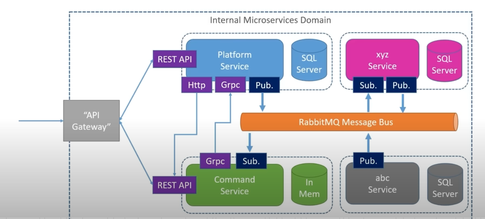
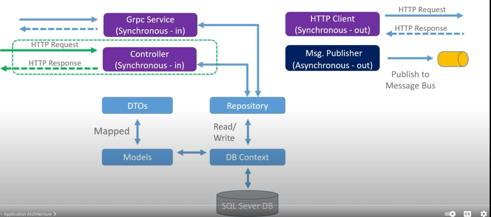
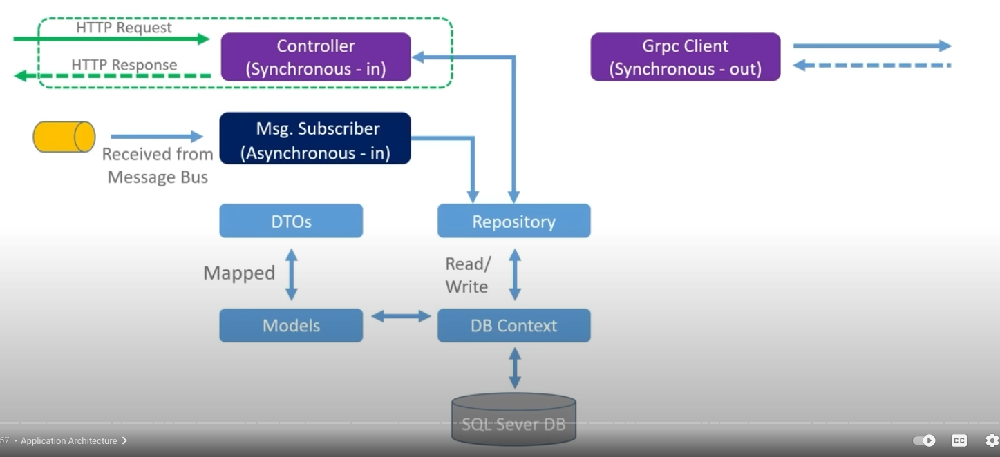

## The Platform Service  

* Function as an "Asset Register"
* Track all the platform / system in the orgnization  
* Built by the infrastructure team 
* Used by:
  * Infra team 
  * Tech support team 
  * Engineering 
  * Accounting  

## The Command Service  

* Function as a repository of command line arguments for given Platforms  
* Aid in the automation of support process  
* Built by technical support team  
* Used by:
  * Tech support team
  * Infra team
  * Engineering  

## Solution Architecture  


## Platform Architecture  


## Command Architecture  


## Synchronous Messaging  
* Request/Response style
* Request will "wait" for response  
* Externally facing services usually synchronous(http requests)    
* Services usually need to know about each other  
* Here using 
  * http
  * grpc  

## What if mark Http actions as async?
```csharp
[HttpPost]
public async Task<ActionResult<PlatformService>> CreatePlatform(PlatformCreateDto platformCreateDto) 
{
    var platformModel = _mapper.Map<Platform>(platformCreateDto);
    _repository.CreatePlatform(platformModel);
    _repository.SaveChanges();
}
```
* From a messaging perspective this method is still synchronous  
* The client has to wait for the response 
* Async in this context (csharp) means that the action **will not wait** for a long running operation  
* It will hand back it's thread to the thread pool, where it can be reused.  
* When the operation finishes it will re-acquire a thread and complete, (and response back to the requester)
* So async here is about thread exhaustion - the requester still has to wait (the call is synchronous  

## Synchronous Messaging Between Services  
* Can and do occur  
* It does tend to pair services, (couple them), creating library  
* Could lead to long dependency chain  

## Asynchronous Messaging 
* No request / response circle  
* Requester doesn't wait  
* Event model, publish - subscribe  
* Typically used between services  
* Event bus is often used  
* 